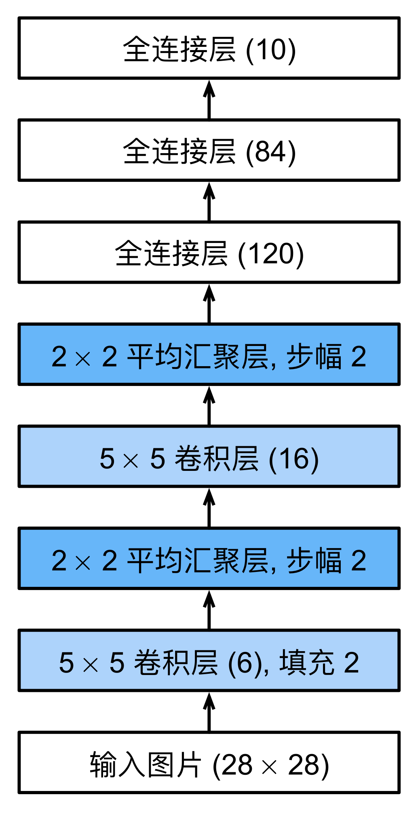
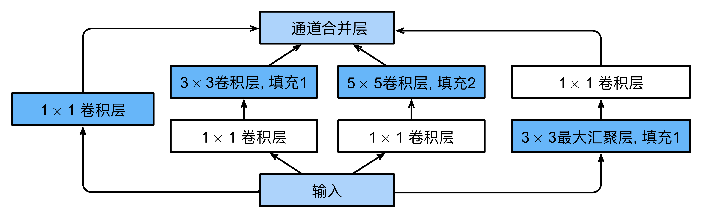
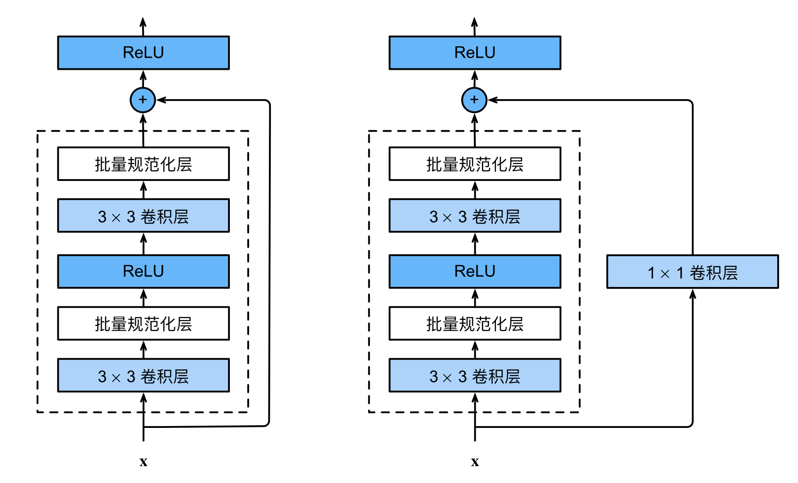
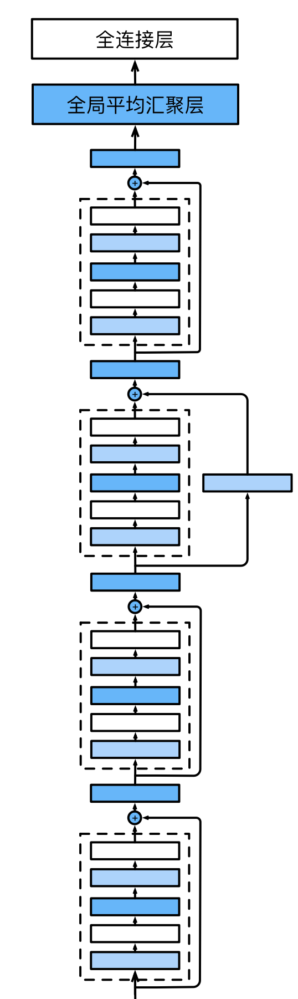
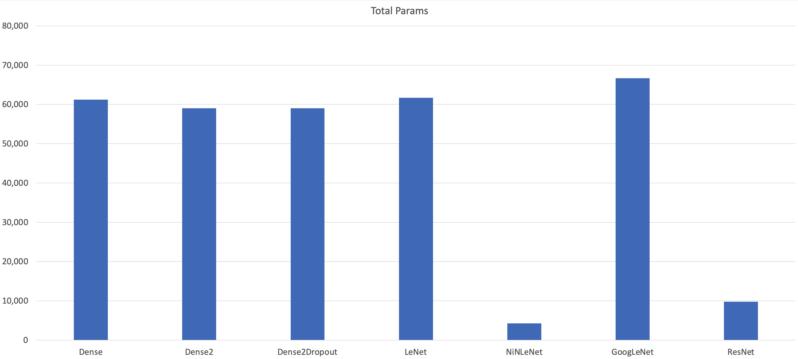
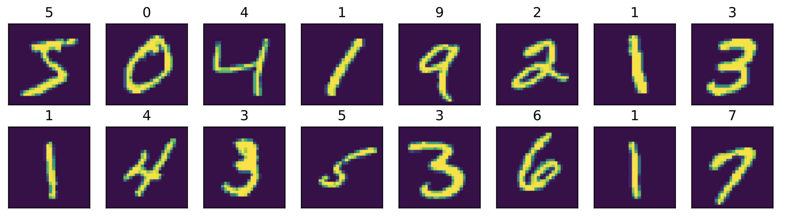
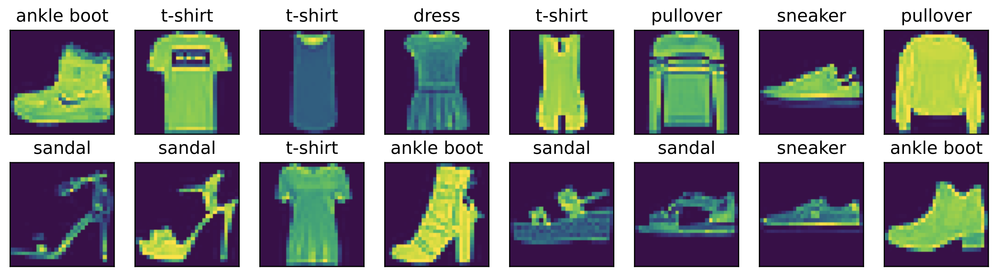
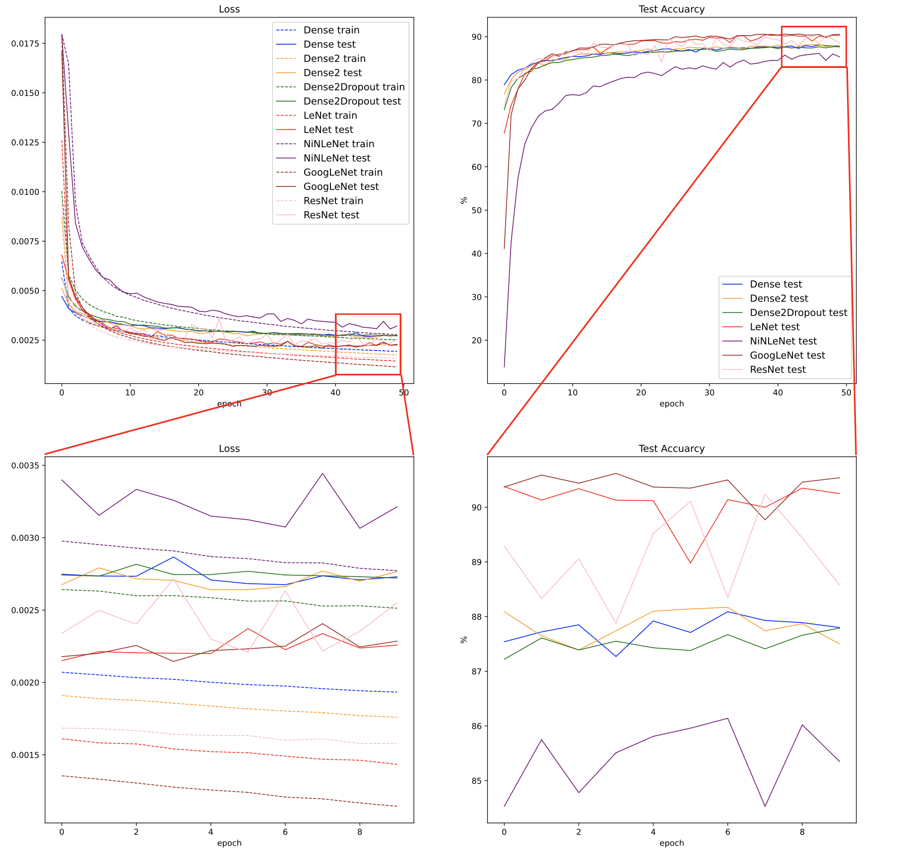

# 普通全连接网络和卷积神经网络比较实验
20373250 张洲浩

### 0 说明

* 本次实验中的部分网络参考自《动手学深度学习 pytorch版》，并做了针对性的简化。其他代码均为独立完成。
* 模型的参数字典.pt文件和训练数据.npy文件附在压缩包内。

### 1 实验目的

#### 基础目的
* 在MNIST数据集上比较参数量基本相同的普通全连接网络和卷积神经网络的效率与性能差异

#### 扩展
* 构建不同层数的全连接网络，分析其差异
* 探究dropout(暂退法)在防止过拟合方面的作用
* 对LeNet做改动，比如加入Inception块，NiN块，残差块，分析其差异
* 在更为复杂的FashionMNIST数据集上分析上述网络的表现

### 2 网络结构
#### 普通全连接网络
* Dense
由一个77节点的隐藏层，一个输出层组成的全连接网络，用relu激活函数。

* Dense2
由一个70节点的隐藏层，一个50节点的隐藏层，一个输出层组成的全连接网络，比Dense更深。

* Dense2Dropout
在Dense2的每个隐藏层后面增加了dropout(0.25)。

#### 卷积类网络
* LeNet
和传统的LeNet网络结构相同，使用了当下更流行的relu激活函数来代替sigmoid。

图1 LeNet 

 

* NiNLeNet
把LeNet后端的全连接用1x1卷积来代替，大大减少了参数量。

* GoogLeNet
参考原始的GoogLeNet中的Inception模块，在LeNet第二层卷积之后增加了该模块。其中每个卷积路线都将输出通道设置为4，随后将LeNet的第三层卷积输入通道设置为16以匹配Inception模块的输出。

图2 Inception块 

 

* ResNet
前端依次为5x5卷积(6),填充2；batchnorm，2x2最大池化，步幅2
后接若干残差块
最后为自适应平均池化和线性层

图3 两种残差块 

 

图4 ResNet后端 

 

#### 参数量

图5 参数量 

 

除了NiNLeNet和ResNet之外，其他网络的参数量均在6万左右
NiNLeNet和ResNet由于使用了更多的卷积来避免全连接，大大减少了参数量

### 3 实验过程

* 搭建了上述的七个网络
* 可视化了数据在LeNet上的流动情况，加深了对卷积网络的理解
* 在MNIST数据集上训练，并测试。每个batch为128，epoch为50，学习率为0.01

图6 MNIST数据集样例 

 

* 绘制了损失，精度随训练轮数的变化曲线
* 在略难的FashionMnist数据集上做了相同的工作

图7 FashionMNIST数据集样例 

 

### 4 实验结果
#### MNIST数据集

图8 LeNet可视化 

 

图9 MNIST数据集实验结果 

 

#### FashionMNIST数据集

图10 FashionMNIST数据集实验结果

 

### 5 结果分析
* 从可视化的结果来看，LeNet的前端卷积实现了对原始输入的特征提取，生成了6个特征图。最大池化层将特征图尺度缩小，同时保留了显著特征。随后的卷积层实现了对更抽象特征的提取，生成了16个10x10特征图，再经过最大池化将其缩小一半，最终经过两个隐藏层的全连接网络，实现了对输入的十分类。在实验中，我用relu函数代替了sigmoid函数，一定程度上预防了梯度消失的问题。
* 综合两个数据集上的表现，可以看出卷积类网络的表现总体上要好于全连接类网络。从理论角度上分析，全连接网络可以实现比卷积网络更好的效果。可以通过一个思想实验来说明：先训练好一个CNN，再搭建一个全连接网络，把全连接层的权重都等效设成CNN里面的权重，得到一个有重复权重的稀疏矩阵。那这个全连接模型的表现就和之前学好的CNN一样好。而这个新的模型还有大量废掉为0的权重可以优化。所以理论上来说，后者的最佳性能是优于CNN的。**然而**，在该任务中，要求二者的参数量基本相同，在这种情况下，全连接网络的表达能力便不如卷积网络了。
* dropout的确可以防止过拟合。在MNIST数据集上的结果中，最后几轮，绿线（带dropout的全连接网络）的测试损失比训练损失要低，这是在其他网络上没有体现出的特性。在FashionMNIST数据集最后几轮结果上，绿线的训练损失和测试损失比其他几种网络更接近，可以看出dropout方法的确在防止过拟合方面发挥着作用。
* 对比GoogLeNet和LeNet，在MNIST上的表现，二者接近。前者在FashionMNIST上的表现则要更好，说明Inception块在提取更复杂，抽象的特征上具有一定的优势。当然，二者的差距需要更复杂的数据集上才能更明显。
* 在两个数据集上，Dense2的表现没有比Dense强太多，可能是仅仅一层的深度增加还无法说明问题，抑或是因为达到了这一类网络的表达能力瓶颈。
* NiNLeNet由于后端采用了1x1卷积而非全连接，大大节约了参数量，也增加了训练时间，但是其最终表现依然十分优秀，在MNIST数据集上超过了参数量是其十多倍的全连接网络。参数量同样很少的残差网络的表现也很优秀。这让我感到很吃惊。
### 6 总结
本次作业进一步丰富了我动手搭建神经网络的经验。对比各种网络的表现，我直观体会到了参考书中不同网络架构的差异，体会到了卷积网络在图像处理领域相对于传统全连接网络的优势。可视化LeNet使我对卷积网络的工作原理认识更深刻。NiNLeNet出乎意料的表现也让我意识到在某些情况下，一味地堆砌参数量可能不是一个明智之举，更好的网络架构可以带来根本的性能提高。总之，这是一次让我受益良多的作业经历。
