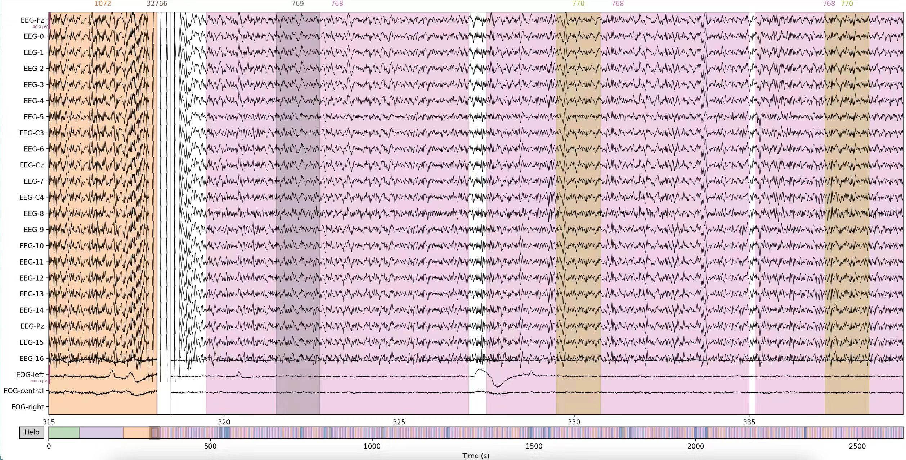
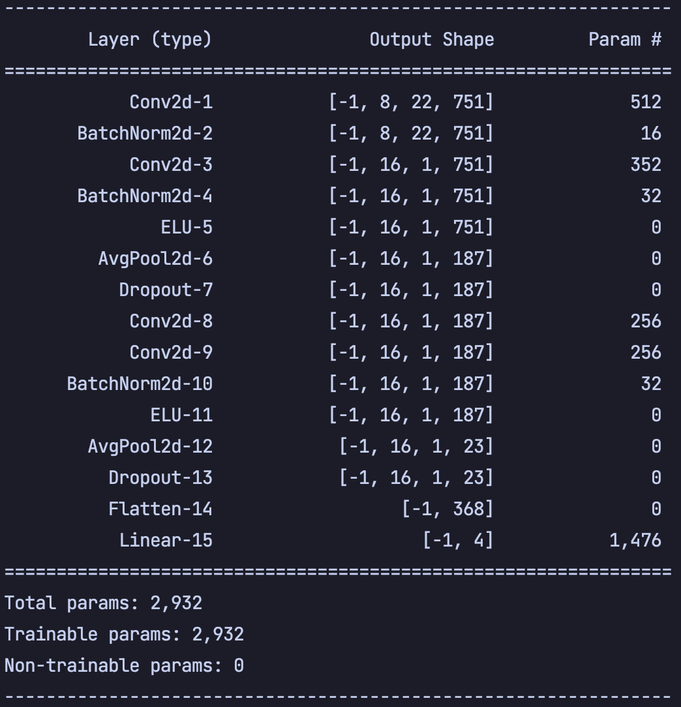
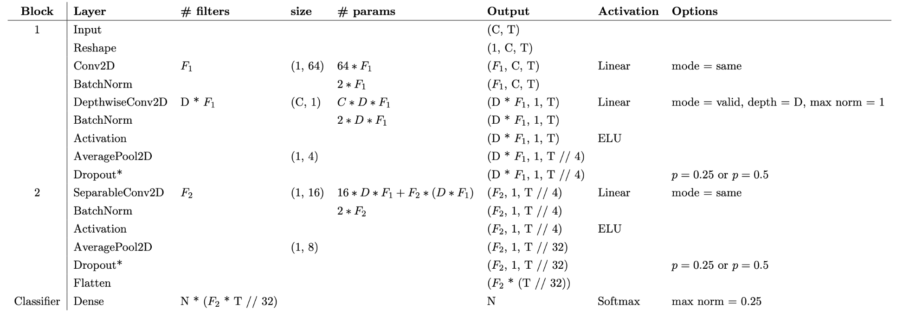
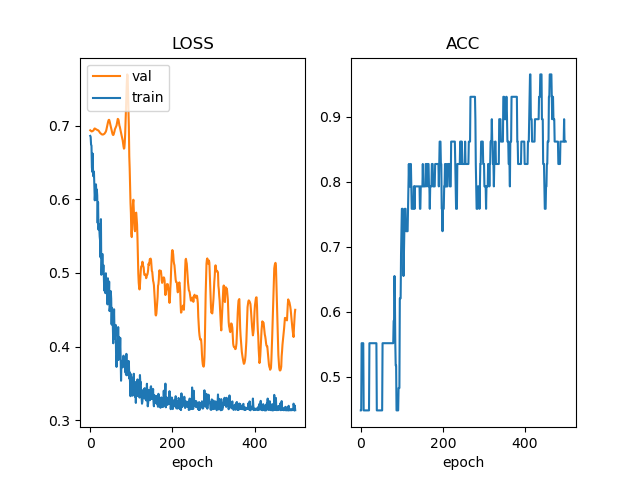
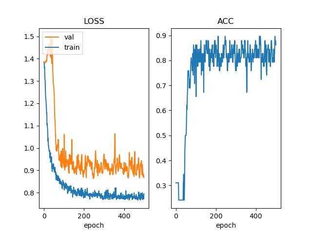

# 基于EEG信号的运动想象分类实验

20373250 张洲浩

## 1 说明

### 实现的功能

* 数据预处理
* 数据可视化
* 用Pytorch复现了所给参考文献中的EEGnet
* 训练了受试者3的二分类模型和四分类模型
* 用训练的模型在所有受试者的测试集上测试，评估了模型性能

### 文件结构

* *.py: 实验源代码
* Data, Label文件夹: 存放数据
* *.png: 实验图片，包括数据可视化，数据频谱，训练过程中的损失和精度的变化情况，模型评估结果
* *.pt: Pytorch参数字典，分别存放了用受试者3的训练数据训练出的二分类模型和四分类模型的参数

### 源代码

#### 对象

* *class EEGDataset(Dataset)*: 数据集制作类，继承自torch.utils.data.Dataset
* *class EEGNet(nn.Module)*: 模型本体，继承自Pytorch的nn.Module类
* *class EEGExperiment*: 实验类，包含数据预处理，模型训练，模型评估

#### 使用方法

安装环境：

* Pytorch（CPU版本或者CUDA版本均可）
* OpenCV
* matplotlib
* mne
* scipy
* torchsummary
* numpy

调整参数：

* BATCH_SIZE: 一次性喂给训练的数据量
* EPOCH: 训练轮数
* CLASS: 二分类or四分类模型
* LR: 学习率
* TRAIN_FROM: 用哪位受试者的数据做训练
* APPLY_TO: 用哪位受试者的数据评估模型
* EVALUATE_ONLY: 仅评估（需要事先训练好对应的模型），若为False则既训练又评估

## 2 数据预处理

使用了Python的mne库进行数据读取

图1 受试者3原始数据 ( 局部 ) 

 

用其filter()方法对数据做4Hz到40Hz的带通滤波，用pick_types()方法选择EEG通道，用Epochs()方法提取了对应事件的数据。详见 *EEGExperiment.pre_process_gdf()*.

使用scipy读取了mat文件中的内容，详见*EEGExperiment.pre_process_mat()*.

特征提取部分由神经网络的第一层卷积实现。由奈奎斯特采样定理，对于该实验，采样率为250Hz，所以使用250/4大小的卷积核可以实现提取4Hz及以上的频率特征。

## 3 模型设计

### 选择EEGnet的理由

初期，我尝试过使用传统的浅层CNN或者LSTM来对数据进行直接分类，发现模型几乎没有收敛的迹象。我对数据进行了离散傅立叶变换，可视化了受试者3的四种运动想象标签下的数据样例，发现其频谱的特征比较难以区分，这意味着用浅层的神经网络很难学习到较为抽象的特征，所以决定复现所给参考文献中的EEGnet网络结构。

图2 受试者3处理后的数据 ( 样例 ) 的幅度谱和数据 

 

### 网络结构设计

我搭建的网络结构如图所示：

图3 网络结构及参数量 

 

该网络依次主要由 *Conv2D*，*DepthwiseConv2D*，*SeparableConv2D*和全连接层组成，其中还包含了若干次ELU激活，平均池化等操作。参数量为2932。

该网络是对EEGnet的复现。EEGnet的源代码依托于TensorFlow框架，我用Pytorch对其进行了重写。

图4 EEGnet结构 

 

* 对于输入为[C, T]的张量，首先使用 *permute()* 方法对其增加一个维度，变成[1, C, T]的张量。
* same模式的2D卷积操作，卷积核大小设置为了(1,64)，输入为[1, C, T]，输出为[F1, C, T]。这一步需要F1个大小为(1,64)的卷积核。
* BatchNorm，参数为Pytorch默认。
* DepthwiseConv2D, valid模式，深度D=2，并限制最大范数为1，这一步需要D*F1个(1, C, 1)的卷积核。
* BatchNorm，参数为Pytorch默认。
* ELU激活。
* (1, 4)平均池化，输出的大小为[D*F1, 1, T//4].
* Dropout, p=0.5.
* SeparableConv2D, same模式，相当于一次DepthwiseConv和一次Pointwise Conv。这一步需要F2个大小为(1, 1, 16)的卷积核，和F2个大小为(F2, 1, 1)的卷积核，输出的大小为(F2, 1, T//4)，same模式。
* BatchNorm，参数为Pytorch默认。
* ELU激活。
* (1, 8)平均池化，输出的大小为[F2, 1, T//32].
* Dropout, p=0.5.
* 拉直，并且送入全连接层，利用softmax函数实现四分类，限制最大范数为0.25.

对于本次实验，我选取了D = 2，F1 = 8 F2 = 16，也就是论文中所述的EEGNet-8,2

## 4 模型训练

我将3号受试者的T数据按照8:2的比例随机划分为训练集和验证集，设置了500轮训练，学习率设置为了0.01，分别训练了二分类和四分类模型。利用交叉熵损失函数和Adam优化器进行了模型训练。初期还曾尝试过用Pytorch的lr_scheduler.ReduceLROnPlateau实现学习率动态调整。

图5 二分类模型训练过程中的LOSS和精度 

 

图6 四分类模型训练过程中的LOSS和精度 

 

可以看出，无论是二分类模型还是四分类模型，在训练开始后，训练集上的损失迅速降低，随后验证集上的损失开始降低。最终，训练集上的损失始终比验证集上的损失要小，这代表着模型不可避免地学习了一些不具有普遍性的特征。最终，二分类模型在验证集上的精度能达到90%以上，四分类则能达到85%以上。与论文中所述情况基本符合。

## 5 模型评估

我用上述训练出的两个模型（即best_3_cls_2.pt和best_3_cls_4.pt）对所给数据集的E数据做了测试，测试了在3号受试者本人身上的效果，以及跨受试者测试。

图7 二分类模型的测试结果 

 

图8 四分类模型的测试结果 

 

可以看出，模型在3号受试者本人身上的精度基本上和训练过程中的验证集上的表现一致，也符合论文中的效果。
然而，对于跨受试者测试的结果却有很大的下降，其中在四分类问题上甚至出现了精度约等于乱猜的精度，体现了模型在跨受试者方面的局限性，泛化能力还有很大的上升空间。

## 6 总结

本次实验我通过深度学习的手段实现了基于EEG信号的运动想象分类。我学习了EEGNet的网络结构，并且用Pytorch亲自复现了这一网络，实现了从数据预处理，特征提取，模型训练和模型评估的全流程。
我实现了二分类模型和四分类模型的训练，并且用面向对象编程的思想将实验很好地封装了起来。还实现了针对3号受试者以及跨受试者的模型评估工作。
从模型的表现来看，其在3号受试者本人上的预测表现达到了较好的效果，在跨受试者上的效果还有很大的上升空间。说明模型的泛化能力还需要进一步加强。
在实现以上功能的过程中，我还学习了各种数据可视化的方法，以及Pytorch的很多其他功能，比如学习率自适应等。
总之，通过本次实验，我将课内知识灵活运用，并且学到了很多新技能，受益良多。