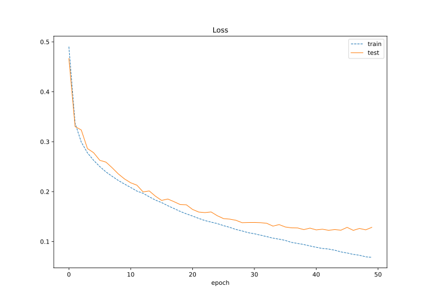
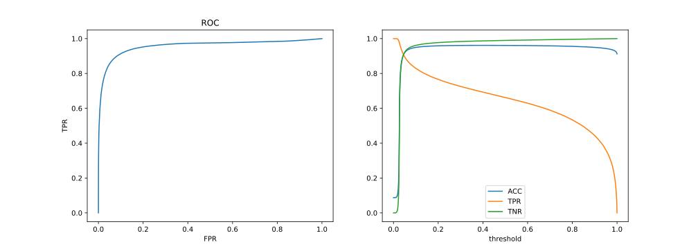
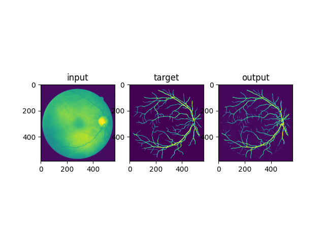
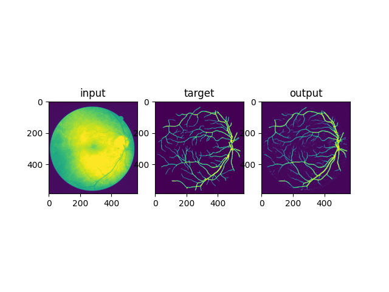

# 眼底血管分割

20373250 张洲浩

## 1 说明

### 实现的功能

* 转换数据的格式为pytorch可以直接读取的png
* 构建经典的图像分割模型UNet，输入三通道彩色图片，输出单通道概率，选取BCEWithLogitsLoss()作为损失函数
* 在所给数据集上训练了该卷积神经网络模型，并且在测试集上评估其性能
* 绘制了训练集损失，验证集损失随训练轮数的变化情况
* 绘制了最终模型的ROC曲线，以及准确率、敏感度、特异性随置信度阈值的变化情况

### 文件结构

* main.py: 实验源代码
* trainset, testset文件夹: 训练数据和测试数据，经过了格式转换
* *.svg: 绘制的实验数据曲线
* Net.pt: Pytorch参数字典，存放了在测试集上表现最好的一组模型参数
* *.npy: 训练数据，numpy格式

### 源代码

* *class DoubleConv(nn.Module)*: 连续两次卷积块，继承自Pytorch的nn.Module类
* *class Down(nn.Module)*:下采样，继承自Pytorch的nn.Module类
* *class Up(nn.Module)*:上采样，继承自Pytorch的nn.Module类
* *class OutConv(nn.Module)*: 最后一层网络输出，继承自Pytorch的nn.Module类
* *class UNet(nn.Module)*: UNet本体，继承自Pytorch的nn.Module类
* *class EXPDataset(Dataset)*: 数据集制作类，继承自torch.utils.data.Dataset
* *class Exp*: 实验类，包含数据读取，数据集制作，损失函数和优化器设置，模型训练，模型评估，曲线绘制

## 2 数据预处理
由于pytorch无法直接读取tif,gif格式的图片，我将数据转换成了其可以直接读取的png格式图片，并且通过统计其像素值的分布，对三个通道做了归一化处理。

## 3 模型设计

### 选择UNet的理由
在实验二取得效果的基础上，我决定再一次用UNet网络来实现该分割任务。

### 网络结构设计

我搭建的UNet网络结构如图：

图1 UNet网络结构 

 

## 4 模型训练

这本质上是一个二分类任务，我采用了BCEWithLogitsLoss作为损失函数。经过多次尝试，使用了RMSprop优化器，选取了比较合适的参数：lr=0.00001, weight_decay=1e-8, momentum=0.9。由于模型参数过多，防止显存不足Batch size设置为了1，训练了50轮。在每一轮训练之后评估了模型，保存了在测试集上表现最好的一组参数。
我在RTX2060显卡的服务器上训练了该模型，期间显存占用率与实验二类似，5G多。

## 5 模型评估

我绘制了模型在测试集和验证集上的损失随训练轮数的变化情况，以及最终模型的ROC曲线，准确率、敏感度、特异性随置信度阈值的变化情况。

图3 LOSS 

 

图4 ROC， 准确率、敏感度、特异性

 

可以看出，在开始训练之后，训练集损失和测试集损失便开始持续下降，尽管模型中采取了防止过拟合操作，但是测试集损失还是比训练集损失略高。在50轮训练之后，训练损失和测试损失都降低到了一个较低水平。
从ROC曲线可以看出，该模型的AUC接近1，说明模型对像素的区分度达到了较高的水平。但是相比实验二而言，召回率有所下降。此外，从准确率，敏感度，特异性随置信度阈值的变化也可以看出，该模型的准确率，特异性都接近1，敏感度随着置信度的提高总体呈下降趋势。不过由于眼底血管的细节更丰富，分割难度更大，所以相比肝脏任务而言，模型的召回率有所下降也是可以预见的情况。

图5 测试样例 

 

模型的测试样例如上图所示。该模型的输出是一个和原图大小相等的二维张量，每个点的值代表该像素属于血管部分的概率。从上面的结果可以看出，该模型的输出中，属于血管部分的像素具有接近1的置信度（黄色），不属于血管部分的像素具有接近0的置信度（紫色），在边缘部分存在一些置信度适中的区域，显示为绿色。这表示边缘部分的分类对于模型来说是具有较大难度的。而且从上图可以看出，标签中的一些细节难免被忽略，难以分割出来。结合ROC曲线来看，该模型在这个任务上的表现确实比肝脏任务要略差一些，说明眼底血管分割任务是一个难度很高的任务。但是经过训练之后，模型已经可以将目标的主体分割出来，也取得了让我满意的效果。

## 6 总结

在实验二做成功的基础上，我再一次将UNet应用于这个分割任务，也取得了不错的结果。然而，由于眼底血管细节繁多，结构更加复杂，所以对模型的要求更高。从ROC曲线来看，模型也取得了相对理想的成绩。结合其准确率，特异性来看，这个模型的表现也依然优秀。从测试样例可以看出，模型可以分割出大部分血管的主体，很多细节虽然置信度不是特别高，但是依然有被分割出来的趋势。
实验三和实验二都属于医学影像分割的范畴。由于个体差异，仪器差异，数据的一致性难以保证，数据量也比较少。在这样高难度的任务上，UNet可以取得很好的成绩，让我感受到了深度学习的强大实力。同时，我也阅读了其他新的分割模型的资料，比如李阳老师的通过预先融合图像边缘信息，结合深度网络来实现眼底血管分割的方法，也给了我很大的启发。
经过这三个实验的锻炼，我对于神经网络的搭建，训练，评估等具体做法已经比较熟悉。这是一次宝贵的经历，为我将来的学习打下了坚实的基础，同时也开阔了我的眼界。