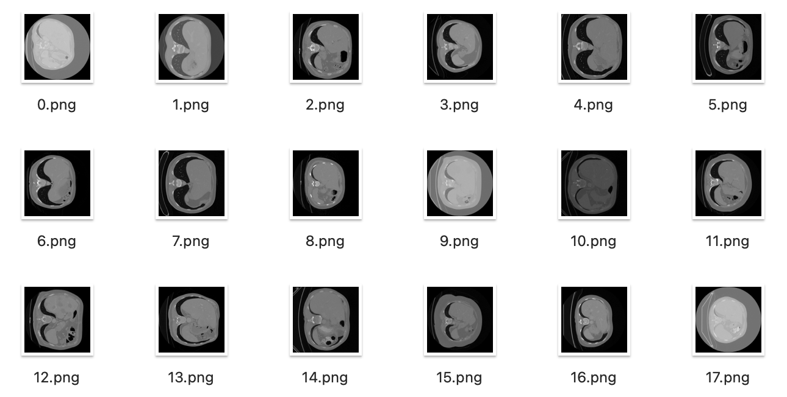
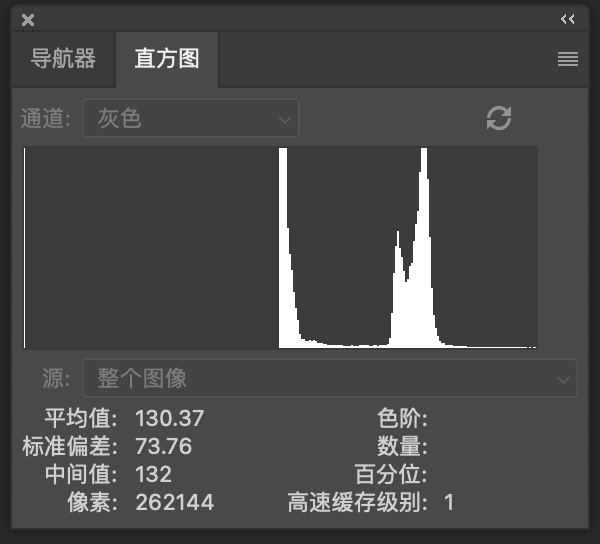
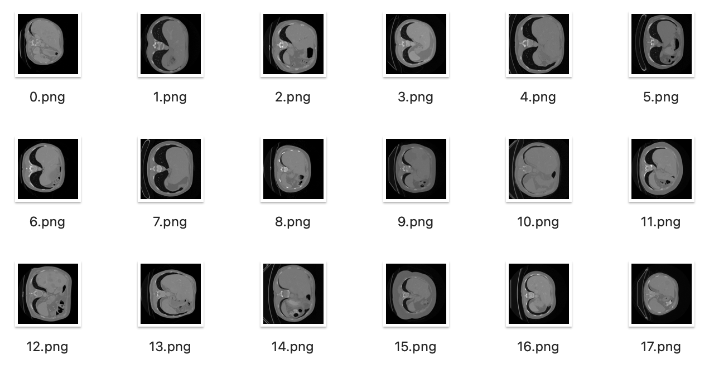
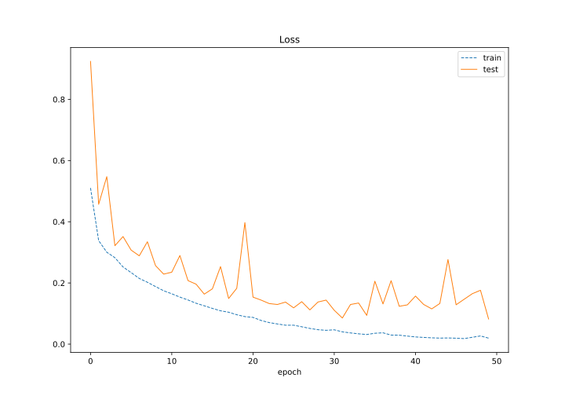
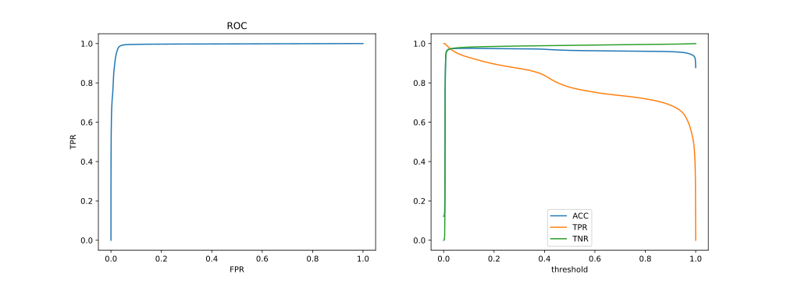
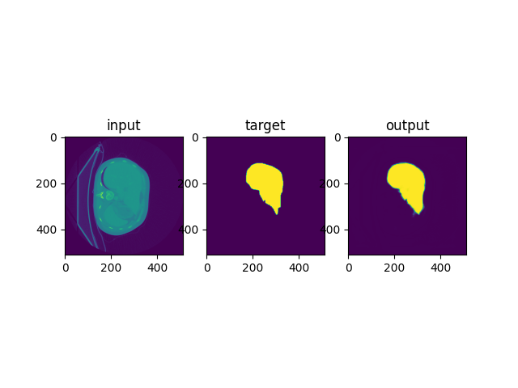
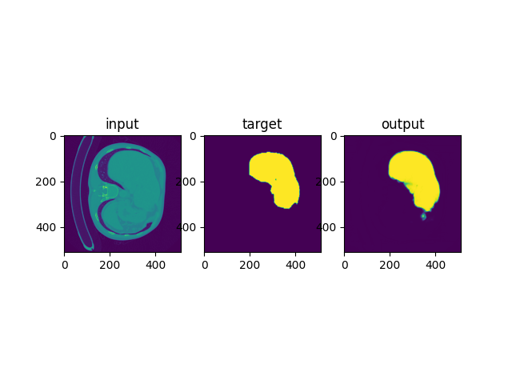

# CT肝脏分割

20373250 张洲浩

## 1 说明

### 实现的功能

* 对数据做预处理，加强了其灰度分布的一致性
* 构建经典的图像分割模型UNet，选取BCEWithLogitsLoss()作为损失函数
* 在所给数据集上训练了该卷积神经网络模型，并且在测试集上评估其性能
* 绘制了训练集损失，验证集损失随训练轮数的变化情况
* 绘制了最终模型的ROC曲线，以及准确率、敏感度、特异性随置信度阈值的变化情况

### 文件结构

* main.py: 实验源代码
* trainset, testset文件夹: 训练数据和测试数据（输入图像已经过灰度一致性处理）
* *.svg: 绘制的实验数据曲线
* Net.pt: Pytorch参数字典，存放了在测试集上表现最好的一组模型参数
* *.npy: 训练数据，numpy格式

### 源代码

* *class DoubleConv(nn.Module)*: 连续两次卷积块，继承自Pytorch的nn.Module类
* *class Down(nn.Module)*:下采样，继承自Pytorch的nn.Module类
* *class Up(nn.Module)*:上采样，继承自Pytorch的nn.Module类
* *class OutConv(nn.Module)*: 最后一层网络输出，继承自Pytorch的nn.Module类
* *class UNet(nn.Module)*: UNet本体，继承自Pytorch的nn.Module类
* *class EXPDataset(Dataset)*: 数据集制作类，继承自torch.utils.data.Dataset
* *class Exp*: 实验类，包含数据读取，数据集制作，损失函数和优化器设置，模型训练，模型评估，曲线绘制

## 2 数据预处理
初期，我并没有增加数据预处理这一步操作，我曾经得到过这样的实验结果：

图1 曾经的失败结果 

 
可以看出，网络出现了严重的过拟合：自从训练开始，在训练集上的损失不断下降，但是在测试集上的损失呈上升趋势。
经过分析，我认为这是由于输入数据的灰度分布不一致导致的。

图2 部分输入数据 

 

从上图可以看出，在这一批数据中的0,9,17号数据灰度总体偏高，10号数据的灰度总体偏低。而其他的数据灰度大致处在平均水平。

图3 1号和10号数据的直方图以及统计信息 

 
从直方图也可以看出，输入数据存在灰度分布不均匀的情况。我推测这是导致模型表现不佳的原因。所以我对输入数据进行了灰度一致性处理，具体方法就是判断出灰度分布明显偏出平均水平的数据，对其他数据做统计，然后以此为依据，对所有数据做归一化处理。

图4 灰度一致性处理之后的输入数据 

 
可以看到，经过一致性处理之后，输入数据的灰度总体偏差变小，实现了预处理目的。

## 3 模型设计

### 选择UNet的理由
UNet是一种用于图像分割任务的深度学习架构，最初由Olaf Ronneberger等人于2015年提出。UNet的设计灵感来自于生物医学图像分割任务中的需求，特别是对于像素级别的分割。UNet的架构由一个对称的U形网络组成，因此得名UNet。它具有编码器-解码器结构，其中编码器负责捕获图像的上下文信息，而解码器则负责生成分割结果。UNet通过跳跃连接（skip connections）实现了编码器和解码器之间的连接，从而使网络能够利用不同层级的特征信息。UNet的编码器部分由一系列卷积和池化层组成，通过逐步降低特征图的尺寸来提取图像的高层次特征。解码器部分则通过上采样和卷积操作逐步恢复特征图的尺寸，并结合来自编码器的跳跃连接信息，使得分割结果具有更好的细节和空间准确性。UNet在图像分割任务中取得了显著的成果，并且在生物医学图像领域得到广泛应用。其架构简单而有效，容易训练和调整，同时在处理小样本和边界细节等方面表现出色。由于其出色的表现，我决定复现这一网络，体验一下这个经典网络架构的强大之处。

### 网络结构设计

我搭建的UNet网络结构如图：

图5 UNet网络结构 

 

## 4 模型训练

这本质上是一个二分类任务，我采用了BCEWithLogitsLoss作为损失函数。经过多次尝试，使用了RMSprop优化器，选取了比较合适的参数：lr=0.00001, weight_decay=1e-8, momentum=0.9。由于模型参数过多，防止显存不足Batch size设置为了1，训练了50轮。在每一轮训练之后评估了模型，保存了在测试集上表现最好的一组参数。
该网络的参数量达到了三千多万。我使用了RTX2060显卡服务器进行训练。训练过程中，显存占用持续在5G多。

## 5 模型评估

我绘制了模型在测试集和验证集上的损失随训练轮数的变化情况，以及最终模型的ROC曲线，准确率、敏感度、特异性随置信度阈值的变化情况。

图6 LOSS 

 

图7 ROC， 准确率、敏感度、特异性

 

可以看出，在开始训练之后，训练集损失和测试集损失便开始持续下降，尽管模型中采取了防止过拟合操作，但是测试集损失还是比训练集损失略高。在50轮训练之后，训练损失和测试损失都降低到了一个较低水平。
从ROC曲线可以看出，这个ROC曲线已经很接近理想水平，AUC接近1，说明模型对像素的区分度达到了很高的水平。此外，从准确率，敏感度，特异性随置信度阈值的变化也可以看出，如果把最终的概率阈值设置成0.5，该模型的准确率，特异性都接近1，敏感度随着置信度的提高总体呈下降趋势。但是在0.1附近可以召回95%的正例，同时拥有很高的准确率和特异性，表现优秀。

图8 测试样例 

 

模型的测试样例如上图所示。该模型的输出是一个和原图大小相等的二维张量，每个点的值代表该像素属于肝脏部分的概率。从上面的结果可以看出，该模型的输出中，属于肝脏部分的像素具有接近1的置信度（黄色），不属于肝脏部分的像素具有接近0的置信度（紫色），在边缘部分存在一些置信度适中的区域，显示为绿色。这表示边缘部分的分类对于模型来说是具有较大难度的。不过，结合ROC曲线来看，该模型在这个任务上的表现已经非常优秀。

## 6 总结

本实验难度较大，数据量不多，对选择合适的模型提出了更高的要求。我通过广泛阅读资料，最终决定了选用UNet这一经典的分割模型。在初期，我遇到了很多失败的情况。通过谨慎分析，大胆尝试，我通过对数据做预处理，改善其灰度一致性，最终训练出了成功的模型。这也提醒了我在深度学习领域，对数据做预处理，保证其分布的一致性有很重要的作用。
训练结束后，我绘制了它的ROC曲线，以及以及准确率、敏感度、特异性随置信度阈值的变化情况，评估了模型的性能。这让我复习了模型评估的准则，也让我感受到了这个经典网络模型的强大之处。这种经历失败，反复尝试，最终成功的经历磨练了我的意志，提升了我学习的成就感，这是一次宝贵的实验经历。