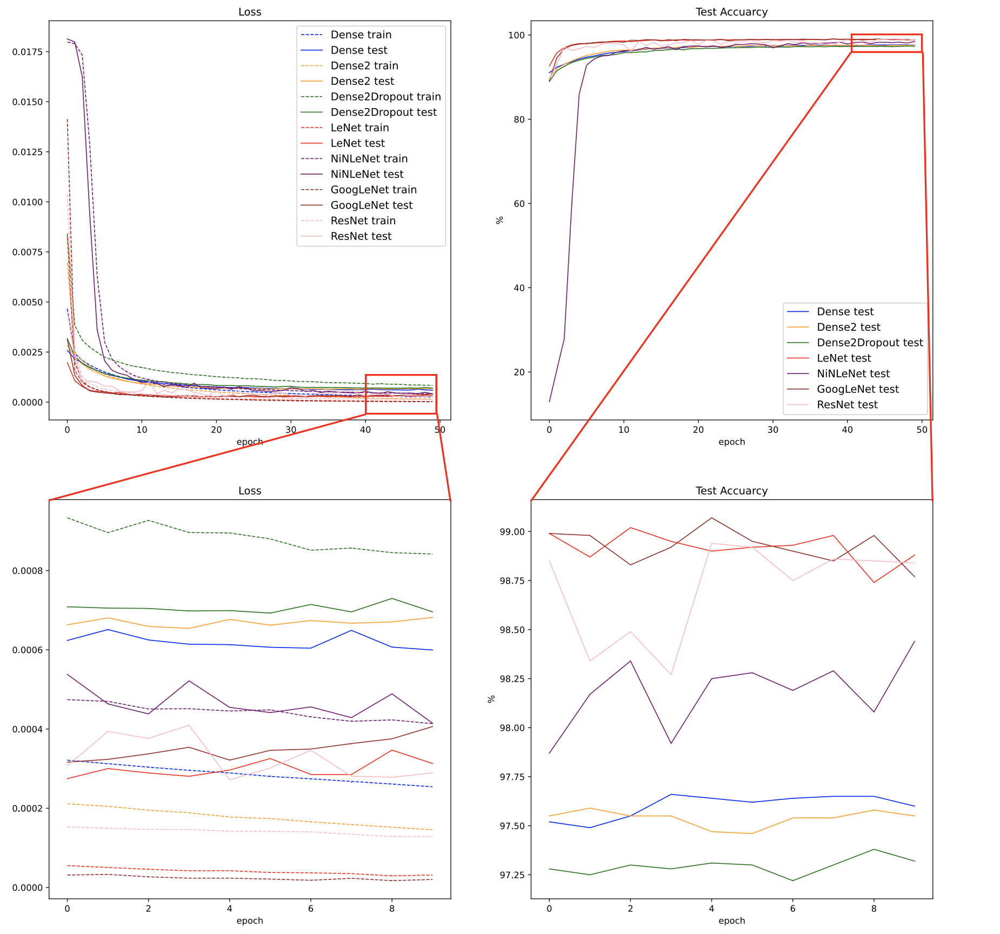
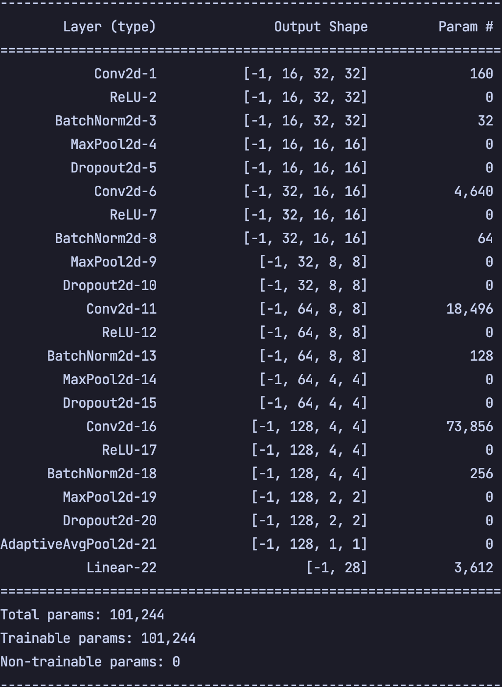
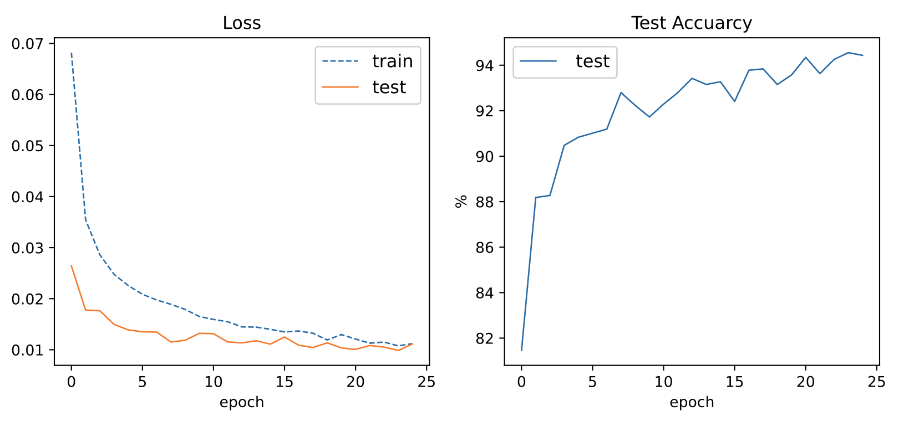

# 实验一 手写阿拉伯字符识别

20373250 张洲浩

## 1 说明

### 实现的功能

* 读入数据，制作Pytorch数据集
* 构建卷积神经网络模型，选取交叉熵作为损失函数
* 在所给数据集上训练了该卷积神经网络模型，并且在测试集上评估其性能
* 绘制了训练集损失，验证集损失，验证集推理精度随训练轮数的变化情况

### 文件结构

* main.py: 实验源代码
* trainset, testset文件夹: 训练数据和测试数据
* figure.svg: 绘制的实验数据
* Net.pt: Pytorch参数字典，存放了在测试集上表现最好的一组模型参数
* *.npy: 训练数据，numpy格式

### 源代码

* *class EXPDataset(Dataset)*: 数据集制作类，继承自torch.utils.data.Dataset
* *class Net(nn.Module)*: 卷积神经网络模型本体，继承自Pytorch的nn.Module类
* *class Exp*: 实验类，包含数据读取，数据集制作，损失函数和优化器设置，模型训练，模型评估

## 2 模型设计

### 选择卷积神经网络的理由
卷积神经网络在处理图像任务上有很大的优势。此前，我在郭玉柱，秦曾昌老师的《模式识别与机器学习》一般专业课上，对比过普通全连接网络和卷积网络在图像任务上的性能差异。我搭建了几种全连接网络和卷积类网络（LeNet，GoogLeNet等）并且在MNIST数据集和FashionMNIST数据集上测试了它们的性能。得出了结论：在图像任务上，卷积网络往往会取得更好的效果，因为它保留了图像的空间结构特征。而普通全连接网络需要将图像拉直再输入，这忽略了图像的空间结构特征。此外，相比于普通全连接网络，卷积网络的卷积层可以看作一个权值共享，部分连接的全连接网络，这减少了参数量，相对不容易发生过拟合现象。从下面的实验结果可以看出，卷积类网络的表现总体强于全连接网络。

图1 不同网络在MNIST数据集和FashionMNIST数据集上的表现 

 

图2 上述网络的参数量 

 

### 网络结构设计

这次我搭建的卷积网络结构如下：

图3 网络结构以及参数量 

 

该网络依次主要由四组卷积与最后的全连接层组成，每一组卷积逐渐增加特征图的通道数，采用ReLU激活函数，采用最大池化来下采样，减少数据量，其中还包含了BatchNorm，Dropout等防止过拟合，提高模型性能的方法。参数量为101244.

## 3 模型训练

这是一个多分类任务，我采用了分类任务常用的交叉熵损失函数来指导训练。使用了Adam优化器，并且通过几次尝试，选取了比较合适的学习率=0.01，Batch size设置为了20，训练了25轮。在每一轮训练之后评估了模型，保存了在测试集上表现最好的一组参数。

## 4 模型评估

我绘制了模型在测试集和验证集上的损失随训练轮数的变化情况，以及测试精度随训练轮数的变化情况。

图4 训练结果 

 

可以看出，在开始训练之后，训练集损失和测试集损失便开始持续下降，由于模型中使用了Dropout暂退法防止过拟合，所以在测试集上的损失要略低于在训练集上的损失。因为在训练过程中，该方法按照一定概率冻结了一些权重，防止模型过度复杂。在测试阶段，模型进入了eval模式，所有权值都参与了推理。
此外也可以看出，损失降低的同时，模型的验证集精度也在呈上升趋势，最终模型在测试集上的精度可以达到94.55%左右，可以看出该模型的泛化能力比较强。

## 5 总结

本次实验，我通过搭建卷积神经网络的方式实现了手写阿拉伯字符识别，这是我继《模式识别与机器学习》大作业之后的又一次亲手搭建神经网络的尝试。有了之前搭建网络的基础，本次实验在技术上并没有什么难度。由于该任务比手写数字识别的难度略高，所以这次我采用了层数更多的卷积网络，旨在学习出输入的更抽象的特征。从结果来看，该网络很好地实现了手写阿拉伯字符识别的功能。

在这次实验中，我重新回忆了使用pytorch搭建神经网络的方法，复习了模型的评估手段，防止过拟合的方法等，起到了理论与实践相结合的目的，使我对神经网络有了更深的理解。