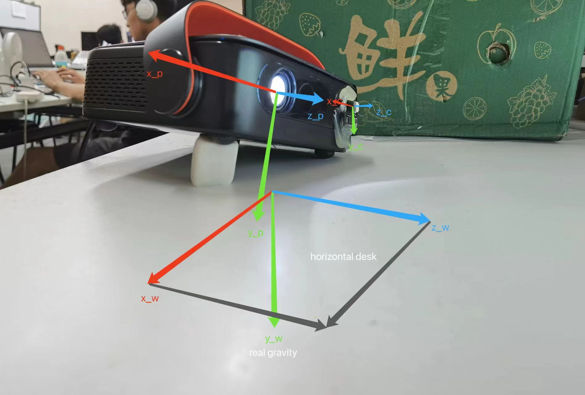

# Auto Keystone Correction Projector with TOF Sensor

## Coordinate Systems

We mainly care about the rotation relationship between coordinate frames, wall frame's and world frame's origin
may be different from what drawn down below, but the directions should be the same with the pictures.


* Wall frame's x-axis is horizontal, y-axis is vertical and parallel to gravity (if it's a vertical wall).
* World frame's y-axis is parallel to gravity, the x-z plane is parallel to horizontal desk. Rotate the projector's
  frame to make its y-axis align with real
  gravity, it's just how we define world's frame. Clearly, the rotation vector's direction between this two frame is the
  cross product of y-axis of the projector's frame and the real gravity.

  
* Origin of projector frame is just the **equivalent** principle point of projector, the system is traditional camera
  coordinate
  system.
* Camera frame here is just the TOF frame, the z-axis is parallel to the TOF infrared light emission direction.
* Image frame is defined in OpenCV coordinate system.

## Source Code

* *calibrationTOF.h*, *calibrationTOF.cpp* implemented the calibrationTOF class, you can get the initial rotation vector
  from TOF frame to **equivalent** projector frame.
* *TOFCorrection.h*, *TOFCorrection.cpp* implemented the TOFCorrection class, which is the main
  contribution of this work.
* *generalFunctions.h*, *generalFunctions.cpp* implemented some geometry functions of this work, be aware that some new
  functions added, different from which of the camera correction project.
* *calibration_demo.cpp* demonstrated how to use the class to calibration TOF sensor's rotation.
* *correction_demo.cpp* demonstrated how to use the class to execute keystone correction.

## Usage

You need **OpenCV** to compile this project:

* How to calibrate the rotation between TOF sensor and **equivalent** projector

```c++
#include "calibrationTOF.h"

int main() {
    cv::Mat tof_data;
    cv::Vec3d rotation_vector_tof2projector;
    
    calibrationTOF calibration(tof_data);
    calibration.calibrate(rotation_vector_tof2projector);
}
```

* How to execute keystone correction:

```c++
#include "TOFCorrection.h"

int main() {
    cv::Mat tof_data;
    cv::Vec3d rotation_vector_tof2wall;
    cv::Vec3d gravity_standard;
    cv::Vec3d gravity_using;
    double EOF_angle;
    double throw_ratio;
    TOFCorrection correction(tof_data, rotation_vector_tof2wall,
                             gravity_standard, gravity_using, EOF_angle,
                             throw_ratio, true);
    cv::Mat offsets;
    correction.correct();
    offsets = correction.offsets;
    correction.update(tof_data, gravity_using);
    offsets = correction.offsets;
}
```

## Notes

* Read comments of source code for more details.
* Test need to be done to find bugs.
* There are still some works to do, to make the algorithm more robust.
