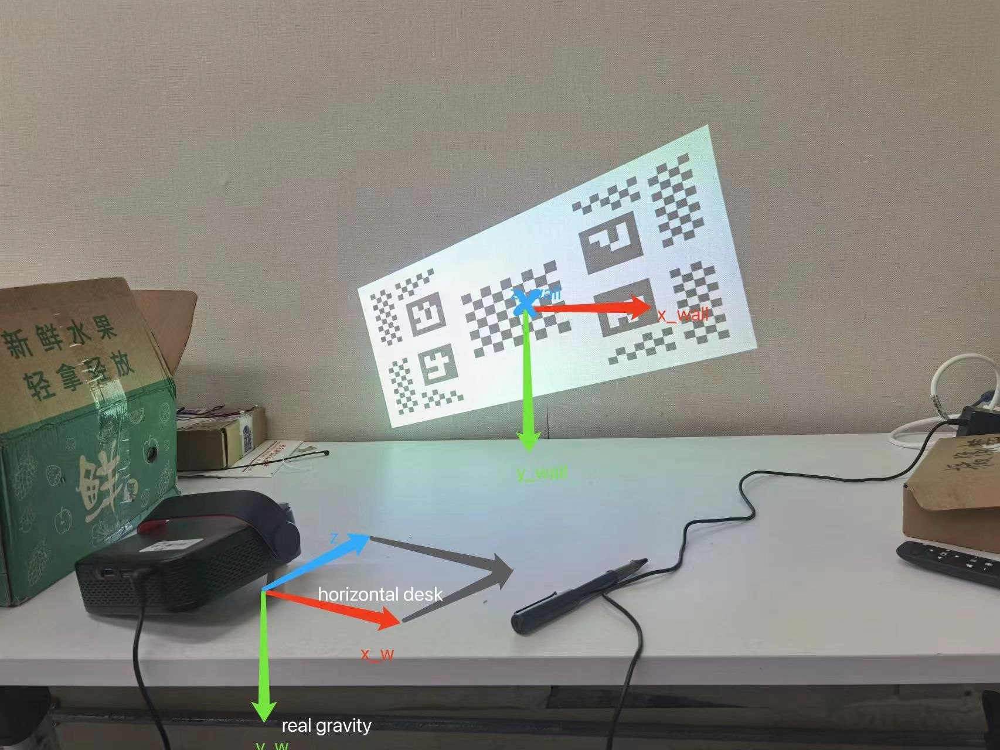

# Auto Keystone Correction Projector with Structured Light Pair

## Coordinate Systems

We mainly care about the rotation relationship between coordinate frames, wall frame's and world frame's origin
may be different from what drawn down below, but the directions should be the same with the pictures.


* Wall frame's x-axis is horizontal, y-axis is vertical and parallel to gravity (if it's a vertical wall).
* World frame's y-axis is parallel to gravity, the x-z plane is parallel to horizontal desk. Rotate the projector's frame to make its y-axis align with real
  gravity, it's just how we define world's frame. Clearly, the rotation vector's direction between this two frame is the cross product of y-axis of the projector's frame and the real gravity.
  
  
* Origin of projector frame is just the principle point of projector, the system is traditional camera coordinate
  system.
* Camera frame is also defined in the traditional approach.
* Image frame is defined in OpenCV coordinate system.

## Source Code

* *KeystoneCorrection.h*, *KeystoneCorrection.cpp* implemented the KeystoneCorrection class, which is the main
  contribution of this work.
* *generalFunctions.h*, *generalFunctions.cpp* implemented some geometry functions of this work.
* *main.cpp* demonstrated how to use the class to help auto keystone correction.

## Usage

You need two libraries to compile this project:

* OpenCV
* apriltag https://github.com/AprilRobotics/apriltag

Start correction:

```c++
// Instantiate the KeystoneCorrection class
KeystoneCorrection correction(camera_intrinsic_mtx, camera_dist_coefs, projector_intrinsic_mtx,
projector_dist_coefs, projector_resolution, R_cinp, t_cinp, gravity_standard,
gravity_using, image_camera, image_projector, false);
// Require offsets and pose from the corrector
cv::Mat offsets1 = correction.offsets;  // Four corners' pixel offsets, follow the opencv coordinate system
cv::Mat rotation1 = correction.rotation_matrix;  // rotation_matrix of projector, in world's coordinate frame
```

Update correction:

```c++
// You can execute a new correction in this way
correction.update(image_camera, gravity_using); // Provide a new camera picture and gravity vector
cv::Mat offsets2 = correction.offsets;
cv::Mat rotation2 = correction.rotation_matrix;
```

## Notes

* Read comments of source code for more details.
* More test need to be done to find bugs.
* There are still some works to do, to make the algorithm more robust.
* The structured light pair of projector and camera need to be calibrated before use. As for how to calibrate it, we use
  the approach proposed in article: *D. Moreno and G. Taubin, “Simple, accurate, and robust projector-
  camera calibration,” in Proc. 2nd Int. Conf. 3D Imag., Model., Process., Vis. Transmiss., Oct. 2012, pp. 464–471.*
