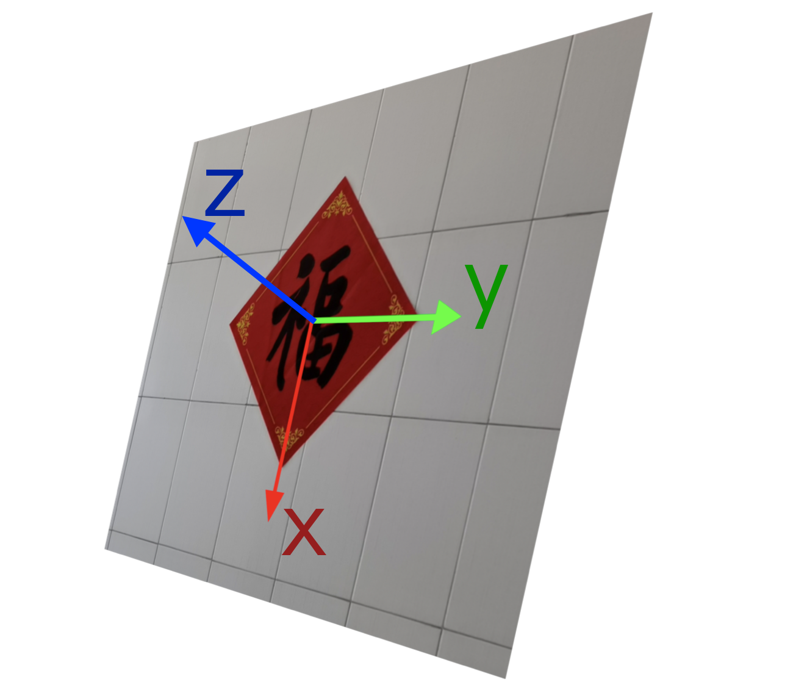

# 计算机视觉基础

### 0. 说明

* 这是**视觉方向考核**的第一题。
  
* 本题仅需要提交一个markdown文件，在其中标清题号作答，简述题不需要答很多。
  
### 1. 相机分类

众所周知，计算机视觉领域使用的传感器为相机。其中，最常用的是RGB相机，比如你的手机摄像头。此类相机无法直接得知目标和相机之间的距离。3D相机可以克服这一不足。
目前较为成熟和普遍的三种3D相机原理分别为双目视觉(stereo)、结构光(structured-light)和光飞行时间法(TOF)。请分别调研这三种3D相机的工作原理，简述之。

### 2.色彩空间

请调研RGB色彩空间和HSV色彩空间的含义，简述之。

### 3. 成像模型

常见的RGB相机遵循针孔成像模型。
描述像素坐标系与世界坐标系之间关系的公式（不考虑畸变）尤为重要，表述如下:
$
Z_c = 
\begin{bmatrix}
   u \\
   v \\
   1
  \end{bmatrix}=
  \begin{bmatrix}
   f_x & 0 & c_x & 0 \\
   0 & f_y & c_y & 0 \\
   0 & 0 & 1 & 0 \\
  \end{bmatrix}
  \begin{bmatrix}
   R & T \\
   0 & 1 \\
  \end{bmatrix}
 \begin{bmatrix}
   X_w \\
   Y_w \\
   Z_w \\
   1
  \end{bmatrix}
  $
  
其中$Z_c$为尺度因子；$u$,$v$为目标物像素坐标（无量纲）；$R$为旋转矩阵(3x3)，$T$为平移矢量(3x1)；$X_w,Y_w,Z_w$为目标物的世界坐标。

$$
\begin{bmatrix}
   f_x & 0 & c_x  \\
   0 & f_y & c_y  \\
   0 & 0 & 1  \\
  \end{bmatrix}
$$

为相机的内参矩阵，通过相机标定可以得到。
*注：不同的文章可能用不同的字母来表示这些量*

* 请简述世界坐标系，相机坐标系和像素坐标系(图像坐标系)是如何规定的。
  
* 请推导说明尺度因子$Z_c$的含义，并查阅相关资料说明内参矩阵中$f_x,f_y,c_x,c_y$参数的含义。
*提示:将矩阵形式写为多项式联立的形式有助于大家更好、更直观地理解*
  
### 4.相机标定

不同相机(即使是同型号)的内参是不同的，同一相机在不同分辨率下的内参也是不同的，需要通过标定来获得内参。
我们使用HUAWEI P40 Pro手机的主摄在1080P分辨率下拍摄了数张棋盘格的照片，放在*chessboard*文件夹中。棋盘格的边长为**2.35厘米**。
使用这些照片，用Python/ROS/Matlab等工具之一对这些图片进行标定。
将你标定得到的内参写在要提交的markdown文件中。
你可能顺便获得了该相机的畸变系数，也可以一并提交。

# 实战-相机位姿估计

### 0. 说明

* 这是**视觉方向考核**的第二题。
* 本题需要提交**两个视频文件，一份源代码，一个markdown文件**。

### 背景介绍

由于RGB相机无法直接测量物体的距离(尺度),所以需要具备一定的条件才能得到物体的位姿，估计出自身的运动状态。本题将为你提供这样一个完备的条件，让你可以用成熟的方法来估计相机的位姿。本题不需要使用深度学习，请用OpenCV视觉库完成。C++或python均可。
有一福字贴在墙面上，我们使用与上一题相同的相机对这个福字拍了一段视频，分辨率为1080p，见*test.mp4*。
现规定世界坐标系：

福字的边长是**38厘米**
请根据下面的要求按部就班地完成相机位姿估计任务。

### 1. 姿态解算
这一部分需要你编写一个程序来处理*test.mp4*,获得如*reference1.mp4*所示的视频。也就是说，你提交的视频需要包括以下要素：
1.识别到的福字的四个角点
2.给四个角点命名，并且让名称始终对应跟踪它。
3.表征相机坐标系和世界坐标系相对位姿的参数，例如示例左上角的平移矢量和旋转矢量。形式不限。能表征二者的相对位姿即可。
4.还原到图像上的世界坐标轴。
技术提示：
1.这个福字和周围的环境比起来有什么突出的特征？让这些特征简化你识别角点的过程。
2.要实现名称的跟踪，请留意：相机的运动比较缓慢，借助前一帧的识别结果辅助你为下一帧的角点命名。当然，你也可以通过提取更复杂的特征来实现，而不依赖上一帧。
3.获取相机和世界坐标的相对位姿。当你做到这一步，你需要用：四个角点的世界坐标（已知），相机内参（第一题标定好的），对应四个角点的像素坐标（你识别出的）。可以认为相机无畸变。
4.为了画出世界坐标系的坐标轴，你需要假想世界坐标系中的四个点：坐标原点，(L,0,0), (0,L,0), (0,0,L), 其中的L可以自己确定一个长度。将这四个世界坐标系中的点通过你上一步解算出的相对位姿关系，变换到图像上，画线。

请提交你的视频，绘画用的颜色不要和提供的参考答案完全一致。命名为*my_answer_1.mp4*
如果你未能完成全部的步骤，提交你做出来的即可。

### 2. 轨迹可视化

这一部分需要你提交一个类似*reference2.mp4*的视频，命名为*my_answer_2.mp4*。这是相机的运动轨迹。
可以借助matplotlib，有能力的同学可以用rviz。
提交实现1和2的代码，名称随意。

### 3. 写一个简要的markdown文件

内容包括
1. 简述你实现以上功能的方式，遇到的困难以及如何解决的。
2. 假如墙上贴的是一个三角形，识别到3个角点，并且已知这三个点对应的世界坐标，还能否解算出相机的位姿？要是四个不共面的点呢？
3. 你画出来的坐标轴以及可视化出来的轨迹是否像参考答案那样有颤抖的现象？产生颤抖的原因是什么？你觉得在识别精度和内参精度已经不能再提升的情况下，如何抑制这种颤抖？
4. 谈谈你做完这道题之后的感受。